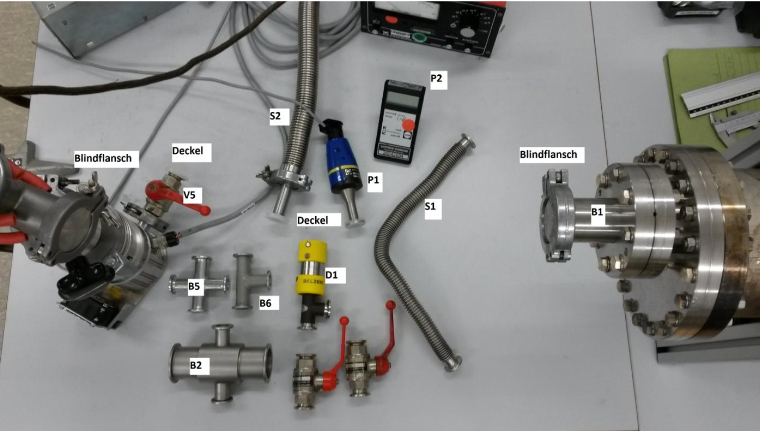

# Vorbereitung für den Vakuumversuch

## Definition des Vakuums
- **Vakuum**: Ein Raum, in dem der Druck deutlich unter dem atmosphärischen Druck liegt. Es gibt verschiedene Vakuumbereiche, die durch den Druckunterschied definiert sind.

## Gasdruck in einem Behälter (Rezipient)
- **Gasdruck**: Der Druck, den ein Gas auf die Wände eines Behälters ausübt, resultierend aus der kinetischen Energie der Gasmoleküle.

## Totaldruck und Partialdruck
- **Totaldruck**: Der Gesamtdruck, der in einem System gemessen wird, bestehend aus dem Druck aller Gase in einem Gemisch.
- **Partialdruck**: Der Druck, den ein einzelnes Gas in einem Gemisch von Gasen ausüben würde, wenn es alleine in einem Behälter wäre.

## Druckeinheiten und Druckbereiche
- **Druckeinheiten**: Typische Einheiten sind Pascal (Pa), Millibar (mbar), und Torr. 1 mbar = 100 Pa, 1 Torr = 133.322 Pa.
- **Druckbereiche**: 
  - Grobvakuum: 1000 mbar bis 1 mbar
  - Feinvakuum: 1 mbar bis 10^-3 mbar
  - Hochvakuum: 10^-3 mbar bis 10^-7 mbar
  - Ultrahochvakuum: unter 10^-7 mbar

## Teilchenzahldichte und Teilchengeschwindigkeit
- **Teilchenzahldichte**: Anzahl der Gasteilchen pro Volumeneinheit, abhängig vom Druck und der Temperatur.
- **Teilchengeschwindigkeit**: Durchschnittliche Geschwindigkeit der Gasteilchen, abhängig von der Temperatur.

## Mittlere freie Weglänge
- **Definition**: Die mittlere freie Weglänge (λ) ist die durchschnittliche Strecke, die ein Gasmolekül zurücklegt, bevor es mit einem anderen Molekül kollidiert.
- **Formel**: 
  λ = (k_B * T) / (√2 * π * d² * p)
  - k_B: Boltzmann-Konstante
  - T: Temperatur in Kelvin
  - d: Durchmesser der Gasmoleküle
  - p: Druck
- **Bedeutung im Vakuum**: In einem Hochvakuum sind die mittleren freien Weglängen der Moleküle groß im Vergleich zu den Abmessungen des Behälters, was bedeutet, dass Moleküle seltener kollidieren und die Effekte der Wandadsorption und -desorption dominanter werden.

## Ideales Gas und Boyle-Mariottesches Gesetz
- **Ideales Gas**: Ein theoretisches Gas, bei dem die Teilchen keine Wechselwirkungen außer elastischen Stößen haben und das Volumen der Teilchen vernachlässigbar ist.
- **Boyle-Mariottesches Gesetz**: Bei konstanter Temperatur ist das Produkt aus Druck und Volumen eines Gases konstant (p * V = konstant).

## Zustandsgleichung für ideale Gase
- **Zustandsgleichung**: p * V = n * R * T, wobei p der Druck, V das Volumen, n die Stoffmenge, R die universelle Gaskonstante und T die Temperatur ist.

## Gasstrom (p-V-Durchfluss) und Strömungsarten
- **Gasstrom**: Der Volumenstrom eines Gases durch eine Fläche pro Zeiteinheit.
- **Strömungsarten**:
  - **Laminare Strömung**: Geordnete Strömung, bei der sich die Gasteilchen parallel bewegen.
  - **Turbulente Strömung**: Ungeordnete Strömung mit Wirbeln.
  - **Knudsen-Strömung**: Strömung, bei der die mittlere freie Weglänge der Teilchen vergleichbar oder größer als die Abmessungen des Behälters ist.
  - **Molekulare Strömung**: Dominant bei sehr niedrigem Druck, bei dem die Teilchen frei zwischen den Wänden des Behälters hin- und herfliegen.

## Strömungswiderstand und Leitwert
- **Strömungswiderstand**: Widerstand, den ein System dem Gasstrom entgegensetzt.
- **Leitwert (C)**: Kehrwert des Strömungswiderstands, gibt die Fähigkeit eines Systems an, Gas durchzulassen.

## Saugvermögen und effektives Saugvermögen

### Saugvermögen (S)
- **Definition**: Das Volumen an Gas, das eine Pumpe pro Zeiteinheit bei einem bestimmten Druck abführen kann.
- **Einheit**: Liter pro Sekunde (L/s) oder Kubikmeter pro Stunde (m³/h).
- **Bedeutung**: Eine entscheidende Kenngröße für die Leistung einer Vakuumpumpe.

### Effektives Saugvermögen (Seff)
- **Definition**: Das tatsächliche Saugvermögen einer Pumpe in einem gegebenen System, welches durch die Strömungswiderstände des Systems beeinflusst wird.
- **Einheit**: Gleich wie das Saugvermögen, L/s oder m³/h.
- **Berechnung**: 
  1 / Seff = 1 / S + 1 / C
  - S: theoretisches Saugvermögen der Pumpe
  - C: Leitwert des Systems
- **Bedeutung**: Wichtige Größe für die Auslegung von Vakuumsystemen, da sie die tatsächliche Leistung der Pumpe im praktischen Einsatz beschreibt.

## Adsorption, Absorption, Desorption und Diffusion
- **Adsorption**: Anlagerung von Molekülen an die Oberfläche eines Feststoffs.
- **Absorption**: Aufnahme von Molekülen in das Volumen eines Feststoffs oder einer Flüssigkeit.
- **Desorption**: Freisetzung von Molekülen von einer Oberfläche.
- **Diffusion**: Bewegung von Molekülen von einem Bereich höherer Konzentration zu einem Bereich niedrigerer Konzentration.

## Methoden der Vakuumerzeugung und -messung
- **Vakuumerzeugung**: Nutzung verschiedener Pumpenarten wie Drehschieberpumpen und Turbomolekularpumpen zur Erzeugung von Vakuum.
- **Vakuummessung**: Verwendung von Geräten wie Piezo-, Pirani- und Ionisations-Vakuummeter zur Messung des Drucks.

## Funktionsweise von Drehschieber- und Turbomolekularpumpen

### Drehschieberpumpe
- **Funktionsweise**: Mechanische Pumpe, bei der rotierende Schieber Gas einfangen und komprimieren, um es aus dem System zu entfernen.
  - Ein Rotor mit beweglichen Schiebern dreht sich exzentrisch in einem Gehäuse.
  - Die Schieber bewegen sich radial in und aus dem Rotor, um Kammern zu bilden, die das Gas einfangen und komprimieren.
  - Das komprimierte Gas wird durch ein Auslassventil ausgestoßen.
- **Druckbereich**: Grobvakuum bis Feinvakuum (1000 mbar bis 10^-3 mbar).
- **Vorteile**: Robust, zuverlässig, kostengünstig.
- **Nachteile**: Begrenzte Fähigkeit, hohe Vakuumdrücke zu erreichen, regelmäßige Wartung erforderlich.

### Turbomolekularpumpe
- **Funktionsweise**: Pumpe, die durch schnell rotierende Schaufeln Moleküle in eine bestimmte Richtung beschleunigt und aus dem System entfernt.
  - Die rotierenden Schaufeln kollidieren mit den Gasmolekülen und übertragen Impuls, wodurch die Moleküle in Richtung des Auslasses beschleunigt werden.
  - Stator-Schaufeln zwischen den Rotoren leiten die Moleküle weiter zur nächsten Stufe.
  - Mehrere Stufen erhöhen die Kompressionseffizienz.
- **Druckbereich**: Hochvakuum bis Ultrahochvakuum (10^-3 mbar bis 10^-9 mbar).
- **Vorteile**: Erreicht sehr hohe Vakuumdrücke, keine Schmierung erforderlich, da berührungsfrei.
- **Nachteile**: Teuer, empfindlich gegenüber mechanischen Schocks und Partikeln.

## Vakuummessgeräte

### Piezo-Vakuummeter
- **Funktionsweise**: Misst den Druck basierend auf der Verformung eines piezoelektrischen Materials, das eine elektrische Spannung erzeugt, die proportional zur Druckänderung ist.
- **Messbereich**: Typischerweise von 1200 bis 5*10^-4 hPa.
- **Genauigkeit**: 
  - 1200-10 hPa: 0,3 % vom Vollausschlag.
  - 10–2*10^-3 hPa: 10 %.
  - ≤ 2*10^-3 hPa: < Faktor 2 vom Messwert.
- **Vorteile**: Schnell und robust, geeignet für mittlere Druckbereiche.
- **Nachteile**: Weniger genau bei sehr niedrigen Drücken.

### Pirani-Vakuummeter
- **Funktionsweise**: Misst den Druck durch die Änderung der Wärmeleitfähigkeit eines beheizten Drahtes, die von der Gasdichte abhängt.
- **Messbereich**: Von 1000 bis 10^-4 mbar.
- **Genauigkeit**: Abhängig vom Druckbereich, typischerweise ±10 %.
- **Vorteile**: Weit verbreitet, einfach zu bedienen, geeignet für niedrige bis mittlere Druckbereiche.
- **Nachteile**: Weniger genau bei hohen Drücken, empfindlich gegenüber Gasart.

### Ionisations-Vakuummeter
- **Funktionsweise**: Misst den Druck durch Ionisation der Gaspartikel und die Messung der resultierenden Ionenströme. Es gibt zwei Haupttypen:
  - **Kaltkathoden-Ionisations-Vakuummeter**: Verwendet ein elektrisches Feld zur Ionisation ohne eine erhitzte Kathode.
  - **Glühkathoden-Ionisations-Vakuummeter**: Verwendet eine erhitzte Kathode zur Ionisation der Gaspartikel.
- **Messbereich**: Von 10^-3 bis 10^-12 mbar.
- **Genauigkeit**: Sehr hoch bei niedrigen Drücken.
- **Vorteile**: Sehr genau bei ultrahohen Vakuumdrücken, geeignet für wissenschaftliche und industrielle Anwendungen.
- **Nachteile**: Komplex und teuer, empfindlich gegenüber Verschmutzungen und Gasart.

## Aufbau 
- S1 = Schlauch 1
- S2 = Schlauch 2 zur Drehschieberpumpe
- D1 = Dosierventil 1
- P1 = analoges Pirani Druckmessgerät
- P2 = digitales Pirani Druckmessgerät
- B1 = Baugruppe 1 = großer Rezipiententank
- B2, B5 und B6 = Bauteile, die montiert werden müssen
- B3 und B4 = Bauteile, die an der Turbopumpe montiert bleiben
- V5 = Kugelventil 5 bleibt am Ausgang der Turbopumpe
- V2 und V3 Kugelventile für die Montage liegen unterhalb von D1 in Bild 1 und müssen montiert werden (siehe Bild 2)
- H1 = Glühkathode Messfühler (fest verbaut)
- V1 = Klappenventil 1
- V2 und V3 = Kugelventil 2 und 3
- B4 = Baugruppe 4, Querschnittsverengung der Turbopumpen-Eingangsseite
- AB1 = dünner Schlauch (dient zur Leitwertreduzierung, optinal)
- V4 = Kugelventil 4 (fest verbaut)
- S2 = Schlauch 2 (bleibt mit V4 an der Drehschieberpumpe fest verbaut)
  H1, B3, V1, B4, Turbopumpe und V5 bleiben fest verbaut und werden am
Versuchsende mit Deckeln verschlossen (siehe Bild 1), Ventile V1 und V5 schließen

